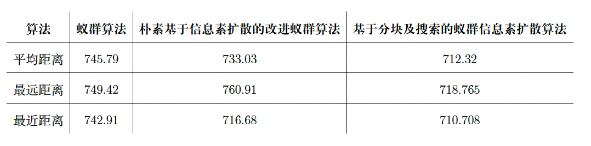

# Improvement of ant colony algorithm based on block and search-Traveling salesman problem

The improvement code was based on C++

After applying our algorithm, we get a better result than the Naive Diffusion ACO algorithm, showing as the following table:

